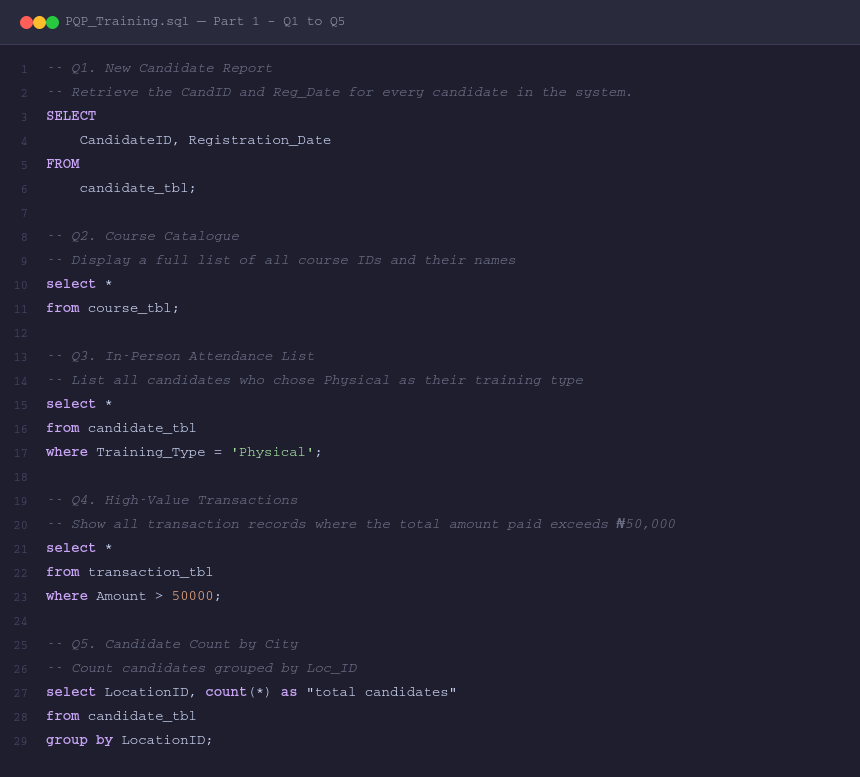
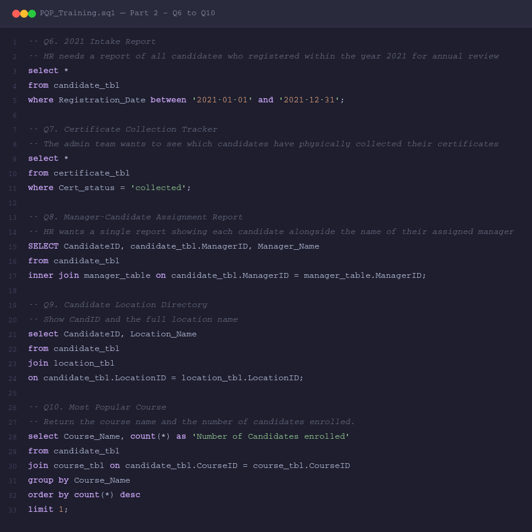
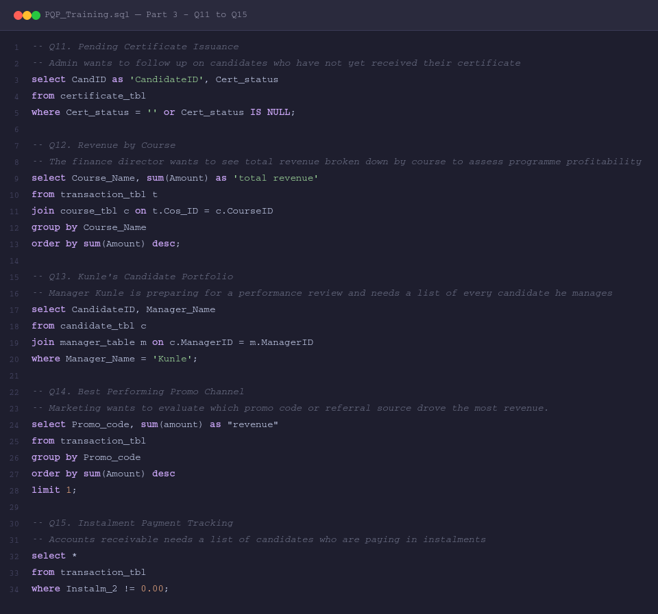

# SQL-PQP-TRAINING

A structured SQL training project built around a candidate management system for a professional qualification programme (PQP). This repository contains the database tables, queries, and screenshots used throughout the training exercise.

---

## 📁 Repository Structure

```
SQL-PQP-TRAINING/
├── data/
│   ├── Candidate_table.csv
│   ├── Cand_course_tbl.csv
│   ├── Certificate_table.csv
│   ├── Course_table.csv
│   ├── Location_table.csv
│   ├── Maneger_tbl.csv
│   └── Transaction_table.csv
├── queries/
│   └── pqp_training_queries.sql
├── Screenshot/
│   ├── PQP_Training_Part1.png
│   ├── PQP_Training_Part2.png
│   └── PQP_Training_Part3.png
├── LICENSE
└── README.md
```

---

## 🗄️ Database Schema

The project uses **7 relational tables** that simulate a real-world candidate tracking system:

| Table | Description |
|---|---|
| `candidate_tbl` | Core table storing candidate details, registration dates, training type, location, course, and manager |
| `course_tbl` | List of available courses and their names |
| `certificate_tbl` | Tracks certificate issuance and collection status per candidate |
| `transaction_tbl` | Payment records including amounts, promo codes, and instalment details |
| `location_tbl` | Location IDs mapped to full location names |
| `manager_table` | Manager IDs mapped to manager names |
| `cand_course_tbl` | Junction table linking candidates to their enrolled courses |

---

## 📝 Queries Overview

The project covers **15 SQL queries** ranging from basic retrieval to multi-table joins and aggregations.

### Part 1 — Q1 to Q5 · Basic SELECT & Filtering

| # | Title | Concepts Used |
|---|---|---|
| Q1 | New Candidate Report | `SELECT`, column aliasing |
| Q2 | Course Catalogue | `SELECT *` |
| Q3 | In-Person Attendance List | `WHERE` filter |
| Q4 | High-Value Transactions | `WHERE` with comparison operator |
| Q5 | Candidate Count by City | `GROUP BY`, `COUNT()` |



---

### Part 2 — Q6 to Q10 · Date Filtering & JOINs

| # | Title | Concepts Used |
|---|---|---|
| Q6 | 2021 Intake Report | `BETWEEN` date range |
| Q7 | Certificate Collection Tracker | `WHERE` string match |
| Q8 | Manager-Candidate Assignment Report | `INNER JOIN` |
| Q9 | Candidate Location Directory | `JOIN` |
| Q10 | Most Popular Course | `JOIN`, `GROUP BY`, `ORDER BY`, `LIMIT` |



---

### Part 3 — Q11 to Q15 · Advanced Filtering & Aggregation

| # | Title | Concepts Used |
|---|---|---|
| Q11 | Pending Certificate Issuance | `IS NULL`, empty string check |
| Q12 | Revenue by Course | `JOIN`, `SUM()`, `GROUP BY`, `ORDER BY` |
| Q13 | Kunle's Candidate Portfolio | `JOIN`, `WHERE` name filter |
| Q14 | Best Performing Promo Channel | `GROUP BY`, `SUM()`, `LIMIT` |
| Q15 | Instalment Payment Tracking | `WHERE` not-equal filter |



---

## 🚀 Getting Started

1. Clone this repository:
   ```bash
   git clone https://github.com/destoboy001/SQL-PQP-TRAINING.git
   ```

2. Import the CSV files in the `data/` folder into your preferred SQL environment (MySQL, PostgreSQL, SQLite, etc.)

3. Open `queries/pqp_training_queries.sql` and run the queries against your database

---

## 🛠️ Tools Used

- **SQL** — MySQL syntax
- **CSV** — Raw data files
- **GitHub** — Version control and project hosting

---

## 📄 License

This project is licensed under the terms of the [LICENSE](LICENSE) file included in this repository.
